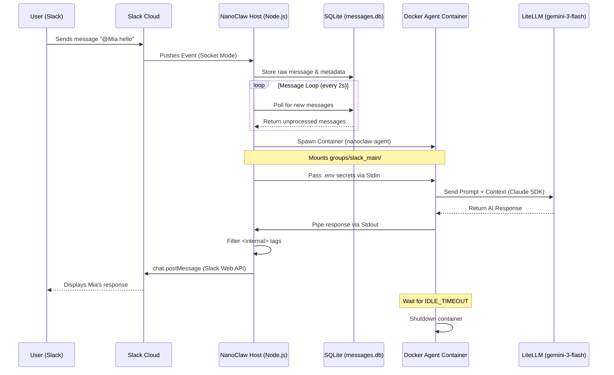

# How NanoClaw Works

This document explains the technical architecture of NanoClaw and the lifecycle of a message as it travels from Slack to your local machine and back.

## Message Lifecycle Diagram

The following sequence diagram illustrates how a message is processed across the different layers of the system.

## Technical Components

### 1. Inbound Layer (Slack Connector)
NanoClaw uses **Slack Socket Mode**. Unlike traditional Webhooks, Socket Mode does not require a public URL or a tunnel (like ngrok). Your local instance opens a persistent WebSocket connection to Slack.
- **Filtering:** In `src/channels/slack.ts`, the system identifies the message source (JID) and ensures it belongs to a registered group before processing.
- **Persistence:** All messages are immediately written to SQLite to ensure that no messages are lost if the agent is busy or the process crashes.

### 2. Orchestration Layer (The Host)
The host process (`src/index.ts`) acts as the "brain."
- **Message Loop:** It constantly monitors the database. It is designed to be "group-aware," meaning it handles conversations in different Slack channels or DMs independently.
- **Group Queue:** To prevent race conditions, each group has a queue. If you send three messages rapidly, the host ensures the agent sees them in the correct order.

### 3. Execution Layer (The Sandbox)
For security, Mia does not run code directly on your Mac. Every time she "thinks," she does so inside a **Docker Container**.
- **Isolation:** The agent has its own Linux environment. It can only see files in your project root (read-only) and its specific group folder (read-write).
- **Ephemeral:** Containers are spawned on demand and destroyed after the `IDLE_TIMEOUT` expires.
- **Secret Management:** Sensitive keys like your `ANTHROPIC_API_KEY` are never stored in the Docker image. They are piped into the container's memory at runtime.

### 4. Intelligence Layer (Agent SDK)
Inside the container, the **Claude Agent SDK** is used to manage the conversation.
- **Model Routing:** As configured in your `.env`, the SDK is pointed to your local **LiteLLM** proxy, which translates the requests for the `gemini-3-flash-preview` model.
- **Memory:** The agent uses a combination of `CLAUDE.md` (for instructions) and session transcripts (for short-term memory) to stay consistent.

### 5. Outbound Layer (Routing)
The response follows the reverse path.
- **Internal Reasoning:** The agent often generates "internal thoughts" wrapped in `<internal>` tags. The host process strips these out so the Slack user only sees the final answer.
- **API Delivery:** The host uses the `SLACK_BOT_TOKEN` to post the final message back to the correct Slack thread or DM.
